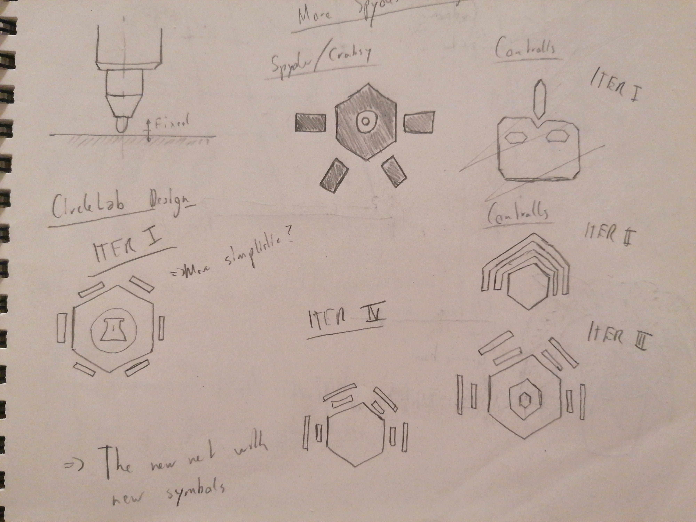
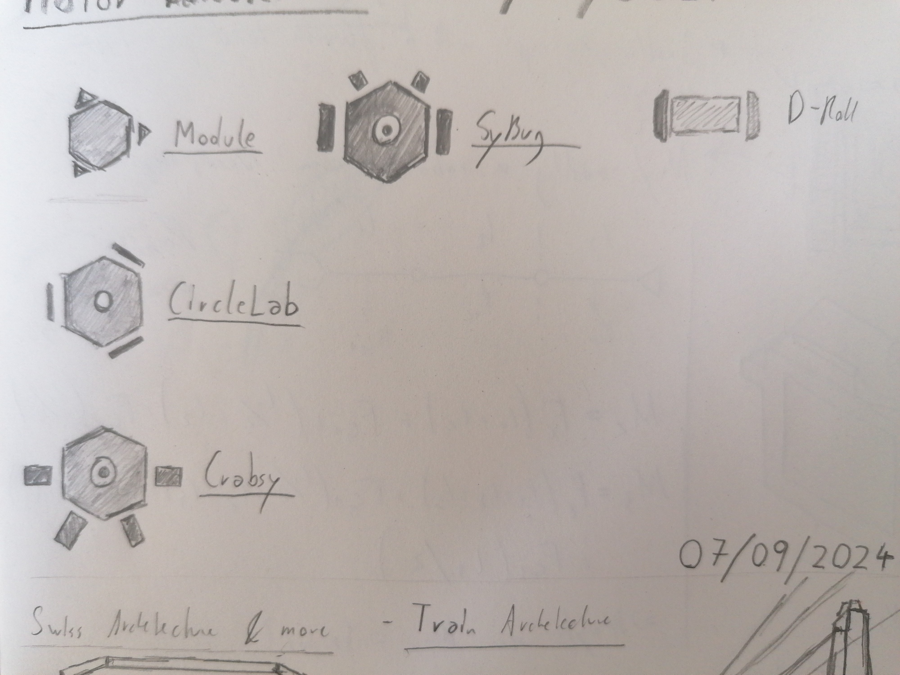
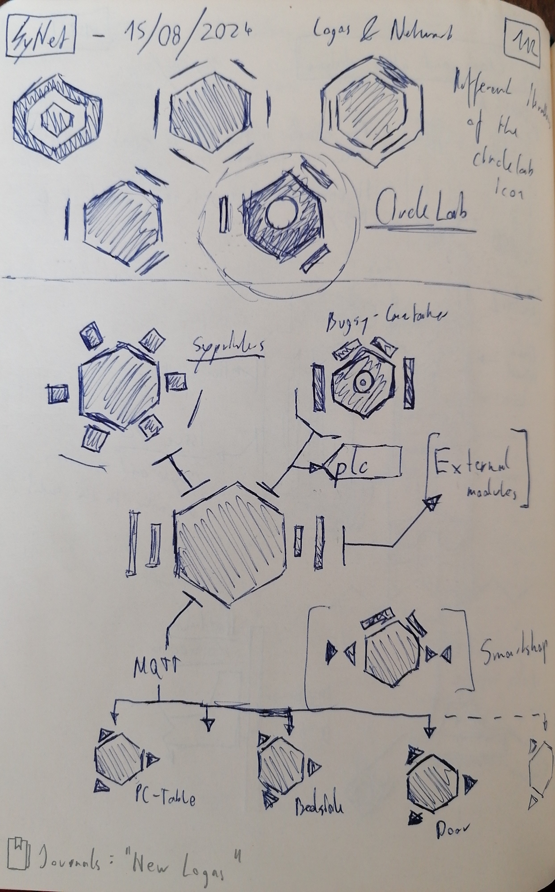
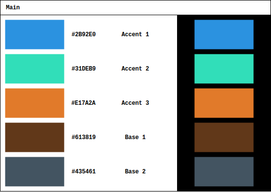

# New logos

> Date: 03/09/2024

I need something to recognize my projects, even for the very small ones like an automation module in my room. What comes to mind of course are simple logos, but the question is of course: How to design them, and how to implement them?

## First iteration for tech

A general design element should be the hexagon, as it is the "bestagon". No seriouly I think the hexagon is a immaculate shape for simple, but good looking logos in tech. So I thought about different ideas for the different types of applications. A list of these applications and the fundamental design keys I assigned for each in the first iteration:

- Robots: They have two concentric circles in the middle of the hexagon, as it kind of looks like and eye, they get little "arms" and "feet" depending on the type of robot they should represent
- Modules and Servers: Filled hexagon, other more complex shapes to give an idea about the servers / modules purpose

## Non tech logos

For other non-tech projects and stuff like equipment and more, I have to actually get really creative, however I do have some styles that will be noticable throughout the whole set of logos. 

Some other things that could require a logo is for example the ... I don't even have a name for it. The small cardboard roll, where I store all my drawings. It could require a logo too, or the suitcase.

> Note for my future self to find a name for stuff first before even considering creating a logo for it

---

## Adding new color scheme

> Date: 07/10/2024

For future logos, I finally created a new color scheme that uses split-complemetary color version of some of my favorite colors!

As a new main font I use "Courier New", not the best choice in my optionion, but the default fonts of draw.io only include a handful of fonts. The nice thing about such a default system font is that there is no need to embed it in any of the logo files!

